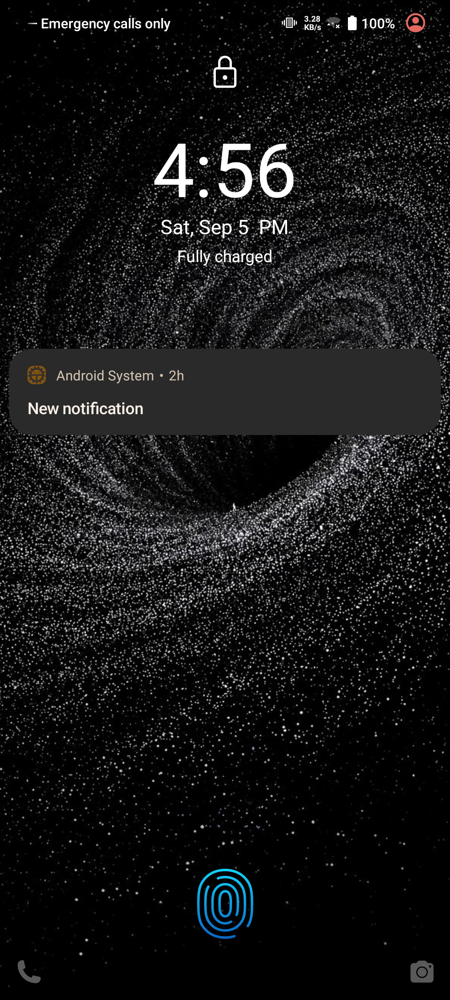
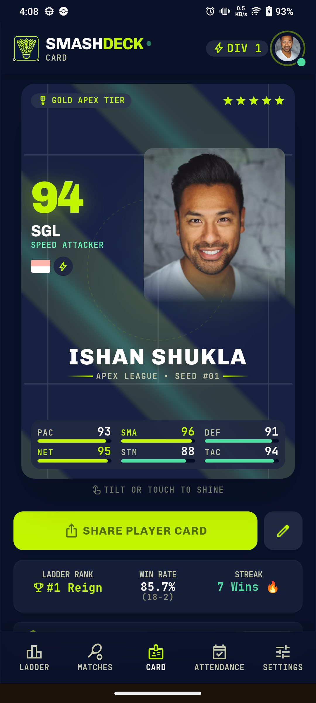
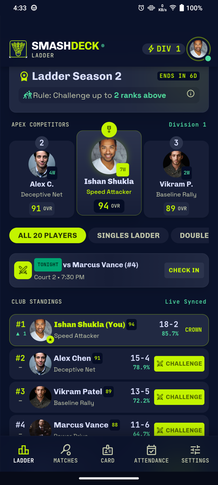

# 🏸 SmashDeck — College Badminton Squad Platform

<div align="center">

[-2ea44f?style=for-the-badge&logo=android&logoColor=white)](https://github.com/AstroNewz/fuzzy-pancake/releases/download/v1.0.0/SmashDeck.apk)
[](https://github.com/AstroNewz/fuzzy-pancake/releases/latest)
[](https://flutter.dev)
[](https://github.com/AstroNewz/fuzzy-pancake/releases)

<p align="center">
  <b>Lightweight, mobile-first squad management, dynamic Trump Cards, live umpire scoring, and intra-club ladder challenge platform built for collegiate badminton squads.</b>
</p>

[📥 Download APK](#-download-apk) • [📱 Installation](#-how-to-install-on-android) • [✨ Features](#-core-features) • [📸 Screenshots](#-screenshots) • [🛠️ Development](#-developer-guide)

</div>

---

## 📥 Download New APK (v1.1.0 - Latest)

The latest build with **Manual Captain Attendance**, **6 New Squad Accounts**, **Squad Common Space & Chat**, **In-App APK Update Popup**, and **Master Control Hub** is available directly in the repository:

| Asset | Version | File Size | Target | Direct Download Link |
| :--- | :--- | :--- | :--- | :--- |
| **`app-release.apk`** | **v1.1.0 (Latest)** | **80.7 MB** | Android 6.0+ (Universal) | [⬇️ **Download Latest APK (v1.1.0)**](https://github.com/AstroNewz/fuzzy-pancake/raw/main/app-release.apk) |

> 💡 **For previous releases**: The legacy `v1.0.0` release is archived under [GitHub Releases v1.0.0](https://github.com/AstroNewz/fuzzy-pancake/releases/tag/v1.0.0).

---

## 📱 How to Install on Android

1. **Download the APK**  
   Click [Download SmashDeck.apk](https://github.com/AstroNewz/fuzzy-pancake/releases/download/v1.0.0/SmashDeck.apk) directly in Chrome/browser on your Android device (or download on PC and transfer via USB).
2. **Open the Package**  
   Tap the download notification or locate `SmashDeck.apk` in your **Downloads** or **Files** app.
3. **Allow Installation**  
   If Android shows a prompt saying *"For your security, your phone is not allowed to install unknown apps from this source"*:
   - Tap **Settings**.
   - Toggle **Allow from this source**.
4. **Install & Launch**  
   Tap **Install** and open **SmashDeck**!

---

## 📸 Screenshots

<div align="center">
  
  &nbsp;&nbsp;&nbsp;&nbsp;
  
  &nbsp;&nbsp;&nbsp;&nbsp;
  
</div>

---

## ✨ Core Features

- 🎴 **Dynamic 3D Trump Cards**:
  - Interactive 3D matrix tilt and flip card view.
  - Overall Rating (OVR) tier frames (Diamond, Gold, Silver, Bronze).
  - Multi-axis attribute radar chart (Smash, Agility, Stamina, Consistency).
  - 1-tap card snapshot sharing to WhatsApp and social channels.

- 🏆 **Intra-Club Ladder ("King of the Court")**:
  - Real-time squad rank leaderboard (Ranks 1–20).
  - Direct ladder challenge management with valid rank rules.
  - Automatic rank swap engine upon upset victory.

- 🏸 **Live Court Umpire & Scoring Engine**:
  - Clean touch scoring UI compliant with BWF 21-point & 30-point deuce rules.
  - Real-time server-side synchronization and dynamic service box / side rotation indicators.
  - Set-by-set completion logging with automatic rating updates.

- ⚡ **QR Attendance Engine**:
  - Instant court check-in scanning.
  - Captain verification workflow for court practice sessions.

- 🛠️ **Racket & Gear Tracker**:
  - Racket string tension date logging.
  - Tension decay tracking and restringing reminders.

- 📶 **Offline-First Durability**:
  - Robust local write queue preserving completed matches across patchy court Wi-Fi.
  - Automatic retries on foreground resume and interval polling.

---

## 🛠️ Technology Stack

- **Framework**: Flutter 3.x (Dart)
- **Backend / Database**: Supabase (PostgreSQL with Row Level Security & Realtime)
- **State Management**: Provider / Riverpod architecture
- **Design System**: Kinetic Athletic Dark UI, Custom Neon Shaders & Haptic Navigation
- **Typography**: Bundled offline athletic typography (no runtime network font latency)

---

## 💻 Developer Guide

### Prerequisites
- [Flutter SDK](https://docs.flutter.dev/get-started/install) (v3.22+ recommended)
- [Android Studio](https://developer.android.com/studio) / Android SDK (API 34)

### Getting Started

```powershell
# 1. Clone repository
git clone https://github.com/AstroNewz/fuzzy-pancake.git
cd fuzzy-pancake

# 2. Install dependencies
flutter pub get

# 3. Run on connected Android device / emulator
flutter run
```

### Building the Release APK

```powershell
# Build universal release APK
flutter build apk --release

# The APK will be generated at:
# build/app/outputs/flutter-apk/app-release.apk
```

### Running Automated Tests

```powershell
# Run static analysis
flutter analyze

# Run unit, widget, and golden tests
flutter test
```

---

## 📄 License

This project is licensed under the [MIT License](LICENSE).
